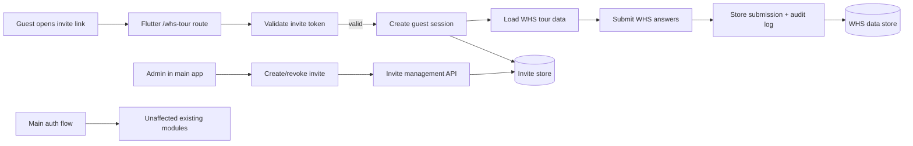

# WHS Tour Standalone Access – Implementation Proposal

## Executive summary
Today, WHS Tour is only reachable from inside the authenticated QA Dashboard flow. Users must first log in to the main app, then navigate to WHS, and the frontend sends the same bearer token for WHS data requests.

This proposal introduces a **separate WHS Tour journey without requiring main-app login** by adding a dedicated guest access flow (invite link + short-lived signed token + anonymous session). This keeps existing admin/authenticated behavior intact while removing friction for external users (auditors, contractors, temporary staff).

Business value:
- Faster onboarding for non-employees and temporary participants
- Less account-management overhead for one-time/occasional WHS participants
- Better completion rates for tours because users can start immediately
- No disruption to current authenticated admin/user workflows

---

## Current architecture overview

### Repository and runtime structure
- Frontend: Flutter web app in `frontend/lib`
- Main backend: NestJS API in `backend/src`
- Reverse proxy routing in `build/traefik/traefik-dynamic.yml`

Key routing observation:
- Main API routes (`/auth`, `/users`, `/accounts`, `/ova`, etc.) route to `backend:3001`
- WHS API routes (`/api/rapport`, `/api/melding`, etc.) route to **another service**: `qa-whs-backend:8080`

This means WHS data APIs are not implemented in this NestJS backend repo; they are external to this codebase and fronted via Traefik.

### Existing login/session model
- Global JWT guard is enabled in NestJS via `APP_GUARD` + `JwtAuthGuard` (`backend/src/app.module.ts`)
- Only explicitly marked `@Public()` endpoints bypass auth (mainly auth/reset/health routes)
- Login returns access + refresh tokens and user object (`backend/src/auth/auth.service.ts`)
- Frontend stores tokens in `SharedPreferences` and refreshes access tokens (`frontend/lib/services/auth_service.dart`)

### How WHS Tour currently fits in
- App startup: unauthenticated users are sent to `LoginScreen`; authenticated users to `HomeScreen` (`frontend/lib/main.dart`)
- WHS is a section inside `HomeScreen` sidebar (`frontend/lib/screens/home_screen.dart`)
- WHS page (`WhsToursScreen`) requires a token parameter and calls WHS API with `Authorization: Bearer <token>` (`frontend/lib/screens/whs_tours_screen.dart`, `frontend/lib/services/whs_api_service.dart`)

### Where frontend depends on authenticated user state
- Route entry depends on `AuthWrapper` auth state (`main.dart`)
- `HomeScreen` retrieves token from `AuthService`
- Dashboard loads WHS data through `authService.getValidAccessToken()` before calling WHS APIs
- App shell (notifications/settings/logout) assumes authenticated context

### Public vs protected backend endpoints (main NestJS service)
Public in this repo:
- `/`, `/health`
- `/auth/login`, `/auth/refresh`, `/auth/logout`
- `/auth/forgot-password`, `/auth/verify-reset-token`, `/auth/reset-password`

Protected by default:
- Accounts, users, departments, OVA, JAP/GPP, notifications, maintenance, etc.

Important ambiguity:
- WHS endpoints themselves are proxied to `qa-whs-backend` and not visible in this repository, so WHS-side auth rules must be confirmed in that service.

---

## Problem statement
The current setup forces all WHS Tour participants through full main-app authentication. This is not ideal for external or occasional users who should complete tours but do not need full QA Dashboard access.

Current pain points:
- External users need account creation and credential support
- Operational overhead for short-term users (auditors, contractors)
- User friction (login barrier) before they can start a tour
- Increased risk of over-permission if temporary users are given standard accounts

---

## Recommended implementation strategy

### Options considered
1. **Fully public guest flow (no token/link controls)**
   - Lowest friction
   - Highest abuse risk
   - Weak auditability

2. **Access code only**
   - Better than public
   - Codes are easy to share/reuse; limited traceability

3. **Kiosk mode (shared station session)**
   - Good for on-site fixed-location use
   - Poor fit for distributed external users

4. **Invite link with short-lived signed token + guest session (recommended)**
   - Low friction (click link, no account creation)
   - Stronger control (expiry, scope, revocation)
   - Better audit trail
   - Minimal disruption to existing logged-in flow

### Recommendation
Implement a **separate WHS guest flow based on signed invite links**:
- Admin creates a WHS invite (scope + expiry + optional usage limits)
- User opens link (web/mobile), app validates token, starts anonymous guest session
- Guest can complete WHS tour and submit
- Main login flow remains unchanged for internal users/admin

Why this is best for this codebase:
- Reuses current HTTP/token approach already used by frontend
- Requires additive changes (new routes/screens/endpoints), not invasive auth rewrites
- Preserves security boundaries better than open public endpoints
- Lower maintenance than full account lifecycle for temporary users

---

## Detailed implementation plan

### A) Frontend (Flutter) changes

1. **Add standalone route entry**
- Add route such as `/whs-tour` in `main.dart`
- Route should bypass `AuthWrapper` and open a dedicated guest flow screen

2. **Create guest WHS screens**
- `WhsGuestLandingScreen` (link validation/loading/errors)
- `WhsGuestTourScreen` (tour form/task UI)
- `WhsGuestSuccessScreen` (submission confirmation + reference ID)

3. **Create dedicated WHS guest service**
- New service (e.g., `whs_guest_api_service.dart`) with endpoints for:
  - invite validation
  - guest session start
  - tour data fetch
  - submit/report save
- Keep `whs_api_service.dart` for authenticated path unchanged

4. **Token handling model**
- Store guest session token separately from `AuthService`
- Do not write guest token into main `auth_token` keys
- Clear guest session on completion/expiry

5. **UX flow**
- Open link → validate → start session → complete steps → submit → show success reference
- Handle expiry/invalid link clearly with retry/contact options

### B) Backend changes

Because WHS APIs route to `qa-whs-backend`, backend work likely spans two services:

#### 1) WHS backend (`qa-whs-backend`, external to this repo)
Add guest-capable endpoints (examples):
- `POST /api/guest-invites/validate`
- `POST /api/guest-sessions`
- `GET /api/guest-tours/:tourId`
- `POST /api/guest-tours/:tourId/submissions`

Rules:
- Accept signed invite tokens only
- Enforce scope/expiry/usage limits server-side
- Return minimal required tour data only
- Never expose admin management endpoints in guest context

#### 2) Main backend (this repo, optional but recommended)
Add admin-only invite management endpoints under existing auth model, e.g.:
- `POST /whs-guest-invites` (create)
- `GET /whs-guest-invites` (list/review)
- `POST /whs-guest-invites/:id/revoke`

This allows authenticated admins to issue/revoke guest access without changing login behavior.

### C) Authentication checks to remove/replace
- **Do not remove existing main auth checks**
- For standalone flow, bypass `AuthWrapper` only for dedicated guest route
- Replace “logged-in user required” with “valid guest invite/session required” for guest WHS endpoints

### D) Data submission without logged-in user
Guest submission payload should include:
- guestSessionId
- inviteId/token hash reference
- optional participant metadata (name/company/email) if business requires
- full WHS answers
- timestamps/client metadata

Persist a clear audit record that this is a guest-origin submission.

---

## Security and data integrity
Required safeguards:
- Signed invite tokens (JWT or equivalent), short TTL (e.g., 24h–7d)
- Token claims include scope (allowed tour/site), expiry, and nonce/jti
- Server-side invite revocation and optional one-time-use limit
- Per-IP and per-invite rate limiting
- Strict input validation and schema validation server-side
- Audit logs for invite creation, validation, session start, submission, revoke
- Idempotency key on submission to prevent duplicate accidental writes
- Segregated guest permissions (no access to `/accounts`, `/users`, admin modules)

Abuse/data-loss prevention:
- Reject expired/revoked tokens
- Use optimistic draft save or autosave for long forms (optional phase 2)
- Track incomplete sessions with timeout cleanup

---

## Migration strategy
Recommended phased rollout (low risk):

### Phase 1 – foundation
- Implement backend guest invite + guest session APIs
- Implement frontend standalone route and basic submit flow
- Keep existing logged-in WHS path unchanged

### Phase 2 – hardening
- Add rate limiting, richer audit logs, revocation UI, better monitoring
- Improve error handling and UX for link expiry/retry

### Phase 3 – optimization
- Add kiosk mode option and enhanced analytics if needed

Compatibility strategy:
- Existing login + HomeScreen + WHS authenticated path remain active during rollout
- New flow is additive, behind explicit route/link usage

---

## Time estimate (best-effort)

### Assumptions
- WHS backend team/codebase is available for endpoint changes
- No major data model redesign required
- Single environment deployment pipeline
- Flutter web is primary client; mobile behavior follows same flow

### Estimated effort

#### 1) MVP / fastest workable
- Analysis + architecture: 8–12h
- Frontend standalone flow: 16–24h
- Backend guest endpoints (minimal): 20–30h
- Auth/session + token handling: 8–14h
- Testing + bugfix: 12–18h
- Deployment support: 4–8h

**Total: 68–106h (~8.5–13.25 person-days @ 8h/day)**

#### 2) Solid production-ready
- Analysis + architecture: 12–18h
- Frontend: 24–36h
- Backend: 32–48h
- Auth/session/security hardening: 18–28h
- Testing (functional/regression/security): 20–30h
- Bugfix/polish/deployment: 10–16h

**Total: 116–176h (~14.5–22 person-days)**

#### 3) Robust with extra security/polish
- Analysis + architecture: 16–24h
- Frontend + advanced UX: 34–50h
- Backend + advanced controls: 48–72h
- Security hardening + observability: 28–44h
- Testing + test automation expansion: 30–45h
- Rollout support + stabilization: 16–24h

**Total: 172–259h (~21.5–32.5 person-days)**

---

## Cost estimate
Formula:

**Cost = Estimated hours × Hourly rate**

Illustrative ranges:

- At €75/h
  - MVP: €5,100–€7,950
  - Production-ready: €8,700–€13,200
  - Robust: €12,900–€19,425

- At €100/h
  - MVP: €6,800–€10,600
  - Production-ready: €11,600–€17,600
  - Robust: €17,200–€25,900

- At €140/h
  - MVP: €9,520–€14,840
  - Production-ready: €16,240–€24,640
  - Robust: €24,080–€36,260

Final cost depends on actual developer rate, final scope, WHS-backend ownership/availability, and required testing depth.

---

## Risks and trade-offs
Major risks:
- WHS backend is external to this repo; integration details may differ from assumptions
- Link-sharing abuse if token policies are weak
- Hidden coupling in WHS data model to authenticated internal user IDs
- Underestimated QA effort for browser/mobile/session edge cases

Trade-offs:
- More convenience (frictionless links) generally increases abuse risk unless token controls are strict
- Strict security settings (short TTL, one-time links) can reduce usability and increase support requests
- Reusing existing auth primitives reduces implementation cost but may limit ideal long-term architecture

Likely underestimated effort areas:
- Cross-service coordination (main backend + WHS backend + proxy)
- Audit/reporting requirements for compliance
- UX edge cases around expired/revoked links and reconnect behavior

---

## Acceptance criteria
Done means all of the following are true:

1. Users can open WHS Tour via dedicated standalone link/route without main-app login.
2. Existing main login/authenticated admin flows still work unchanged.
3. WHS guest submissions are saved correctly with traceable guest-session metadata.
4. Protected endpoints (`/accounts`, `/users`, etc.) remain protected.
5. Guest sessions cannot access admin/internal APIs.
6. Expired/revoked invite links are rejected server-side.
7. UX is smooth on targeted web/mobile platforms, including error states.

---

## Testing recommendations

### Functional
- Valid invite link starts guest session and opens WHS tour
- Expired/revoked/invalid link shows correct error and blocks submission
- Guest can complete and submit tour end-to-end

### Regression
- Main login, token refresh, logout still work
- Admin account management and existing modules unaffected
- Existing authenticated WHS flow still works

### Security
- Attempt direct access to protected routes with guest token → rejected
- Replay/reuse token tests (when one-time policy enabled)
- Rate-limit behavior for repeated validation/submission attempts
- Input validation and payload tampering checks

### Manual sign-off scenarios
- External user from fresh browser session
- Mobile browser network interruptions mid-form
- Two users using same invite behavior (if max-use >1 policy)
- Admin revokes invite while session is active

---

## Optional appendix

### Suggested target architecture (Mermaid)

### Implementation checklist
- [ ] Confirm WHS backend endpoint ownership and current auth checks
- [ ] Define invite token claims and expiry policy
- [ ] Implement guest invite/session APIs
- [ ] Implement Flutter standalone route and guest screens
- [ ] Add audit logging + rate limiting
- [ ] Run functional/regression/security test plan
- [ ] Roll out by phase with monitoring

### Future enhancements
- QR-code invitation generation
- Kiosk mode with rotating session keys
- Self-service reissue flow for expired invites
- Deeper analytics for completion funnel and drop-off reasons
